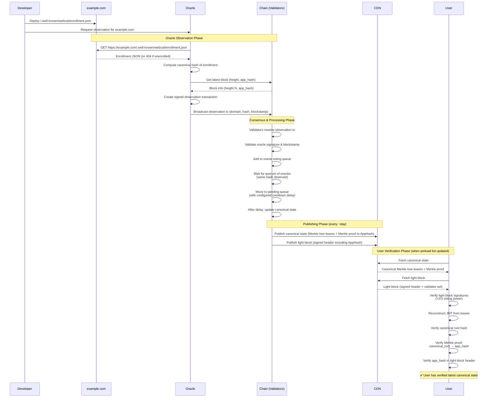
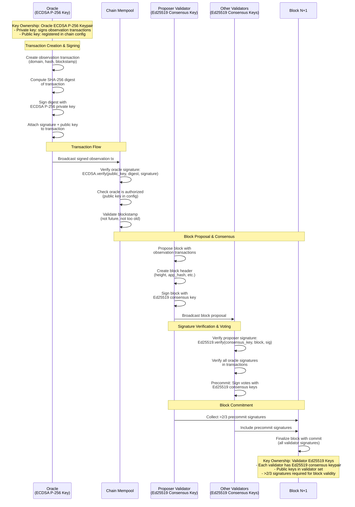

# Sequence Diagrams

## Enrollment Flow

This document illustrates the flow of enrolling a domain in WEBCAT. Also see the
specification [here](https://github.com/freedomofpress/webcat-spec/blob/main/enrollment.md).

## Oracle and Validator Flows

This diagram shows the crypto operations specifically between oracles and validators:

